# CryptoQuant Engine

**Crypto quantitative trading platform for Binance USDM Futures.**

Full-stack algorithmic trading system with signal generation, strategy backtesting, bot execution, real-time market data, and comprehensive analytics. Built with Python/FastAPI backend and Next.js/React frontend.

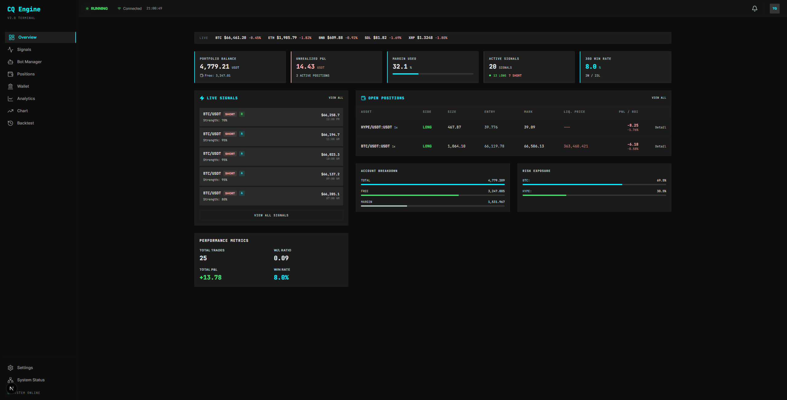

---

## Features

- **Signal Terminal** — Real-time trade signal feed with multi-strategy scoring, R:R ratios, filtering by grade/direction/status, expandable detail panels with strategy scores and market context
- **Trading Bot** — Paper + Live mode, configurable strategies, SL/TP management with trailing stops, paper balance persistence across restarts
- **TradingView Chart** — Candlestick chart with 16 technical indicators, live order book (20 levels), infinite scroll history, bottom trading panel (Positions/Orders/Trade History/Place Order)
- **Position Manager** — Live Binance positions with real-time P&L, trade history with expandable details (close reason, holding time, fees), strategy name tracking
- **Wallet** — Multi-wallet balance overview, internal transfers, margin analysis
- **Backtesting** — Historical strategy simulation with 10 interactive Recharts charts (equity curve, drawdown, rolling Sharpe, P&L scatter, win/loss distribution, P&L by direction, consecutive streaks, cumulative fees, duration vs P&L, monthly returns), multi-verification cross-checks, CSV export
- **Strategy Comparison** — Dedicated comparison page: overlay equity curves, metrics table with best/worst highlighting, drawdown comparison across up to 4 backtests
- **Analytics** — Real performance metrics from closed positions (Sharpe, Sortino, profit factor, equity curve), interactive Recharts charts with hover tooltips, CSV export
- **DCA / Average Down** — Fully configurable dollar cost averaging: trigger %, qty multipliers per level, SL/TP recalculation modes, risk budget enforcement
- **Notifications** — Real-time bell notifications from WebSocket events (signals, position opens/closes, bot status changes, errors)
- **Settings** — Tabbed settings: Exchange API, Risk Management, DCA, Execution Policy (strategy/grade matrix), Alerts (Telegram/Discord), Security (change password, session info)
- **System Monitoring** — Component health (DB, Redis, Exchange, WebSocket, Bot), latency tracking, error alerts
- **Security** — JWT auth with bcrypt, rate limiting (300/min general, 10/min auth), CORS protection, encrypted API keys, WebSocket JWT auth

---

## Screenshots

| Login | Dashboard | Signal Terminal |
|:---:|:---:|:---:|
| 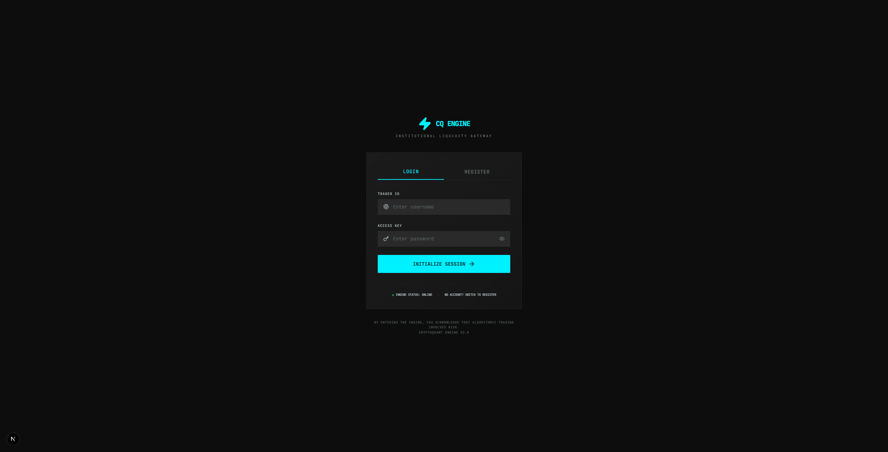 |  | 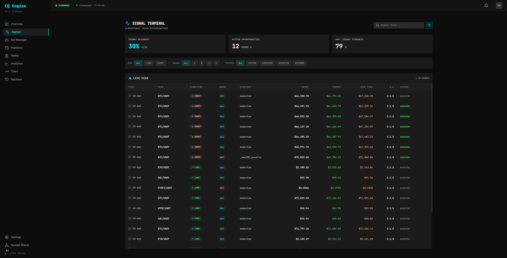 |

| Bot Manager | Position Manager | Wallet |
|:---:|:---:|:---:|
| 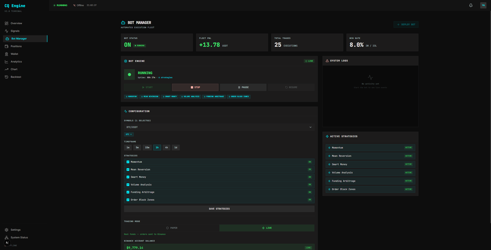 | 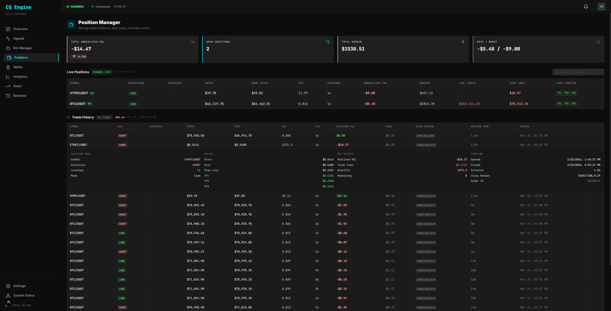 | 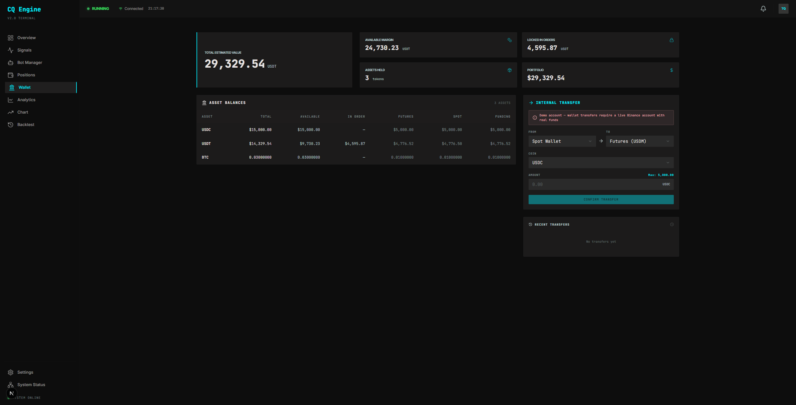 |

| Chart | Analytics | Backtest |
|:---:|:---:|:---:|
| 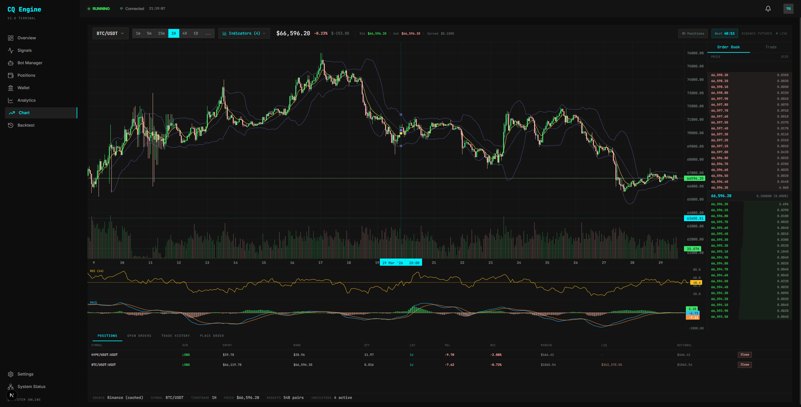 | 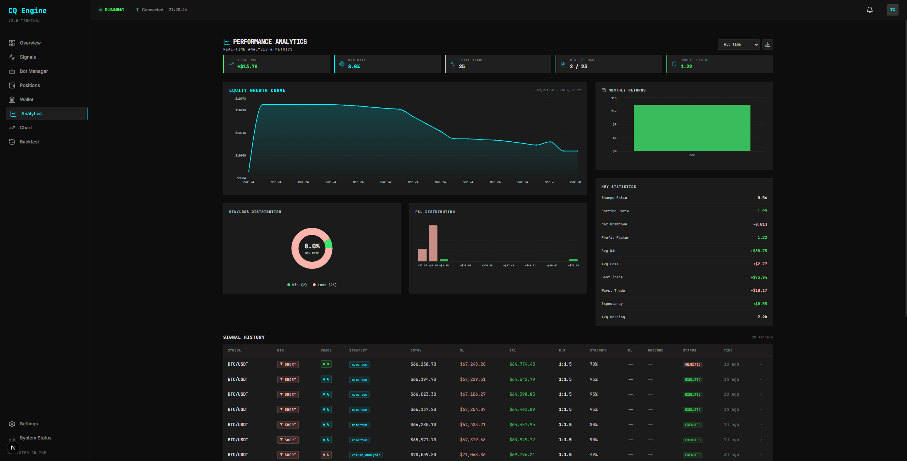 | 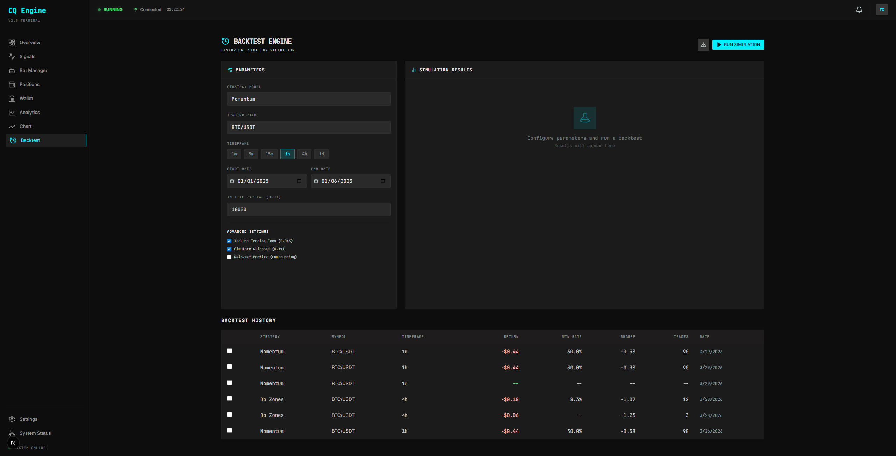 |

| Settings | System Status |
|:---:|:---:|
| 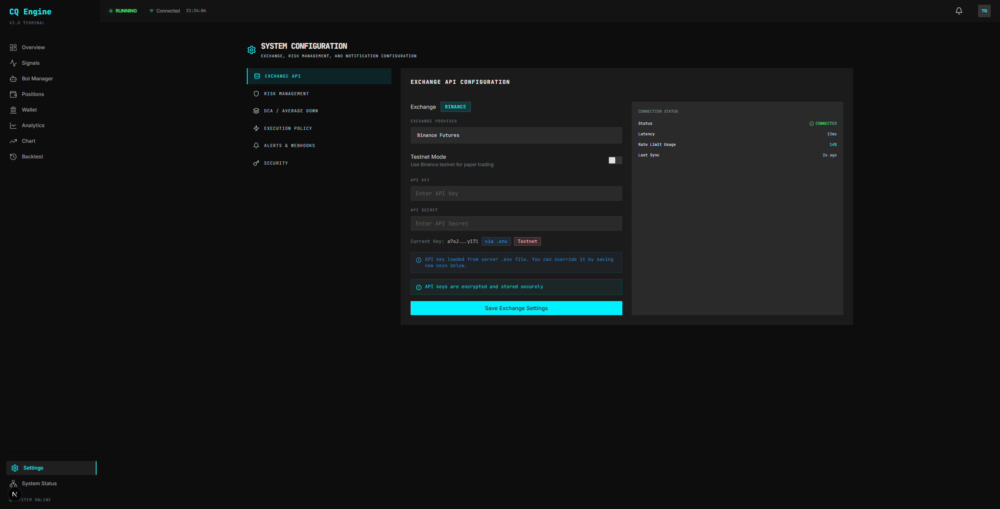 | 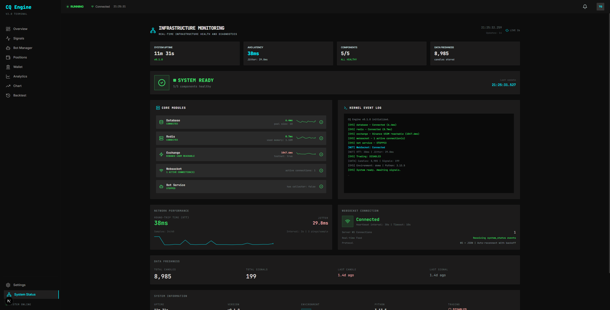 |

| Backtest Results | Strategy Comparison |
|:---:|:---:|
| 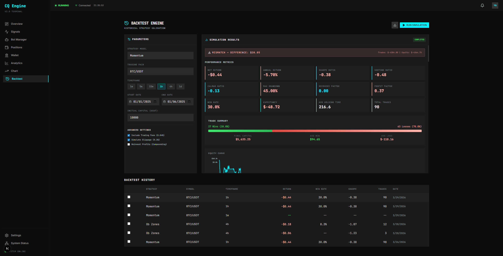 | 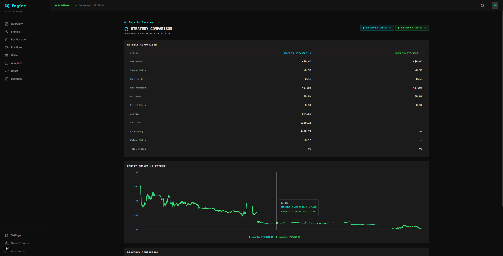 |

---

## Architecture

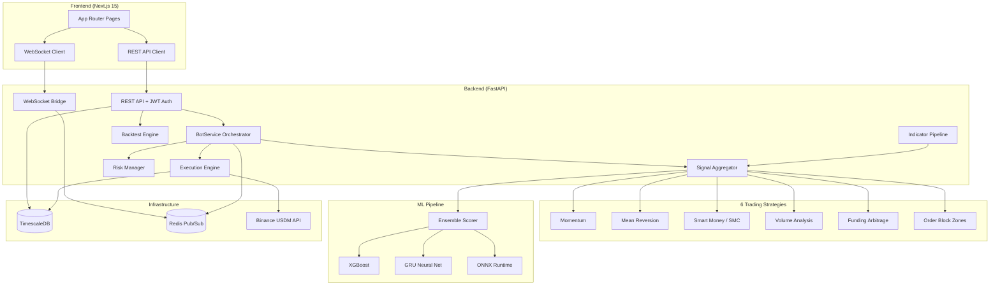

---

## Signal Pipeline

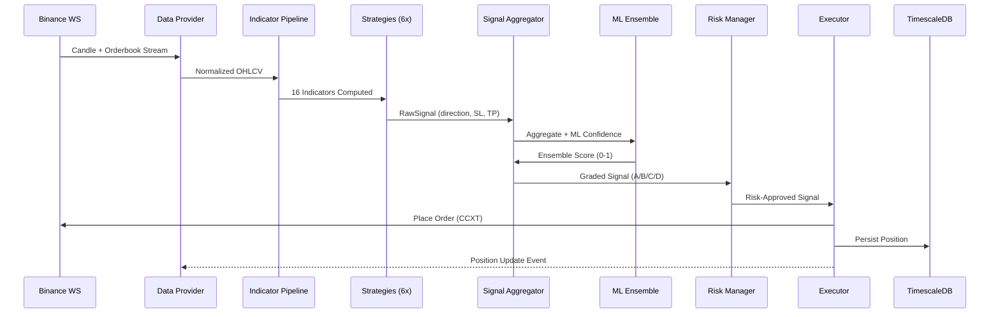

---

## Database Schema

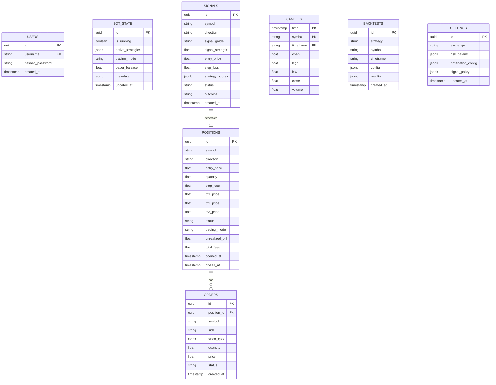

---

## Tech Stack

| Layer | Technology |
|-------|-----------|
| **Frontend** | Next.js 15.5, React 19, TailwindCSS 4, TradingView Lightweight Charts 5 |
| **Backend** | Python 3.13, FastAPI, SQLAlchemy 2 (async), structlog |
| **Database** | TimescaleDB (PostgreSQL 16 + asyncpg), Redis 7 |
| **Exchange** | Binance USDM Futures via CCXT 4 (dual: ccxt.pro WS + ccxt.async_support REST) |
| **ML** | XGBoost, GRU (PyTorch), ONNX Runtime |
| **Auth** | JWT (bcrypt), per-request token validation |
| **Deploy** | Docker Compose, Oracle Cloud Always Free (4 ARM, 24GB RAM) |

---

## Quick Start

### Prerequisites
- Docker + Docker Compose
- Python 3.13+ with venv
- Node.js 20+
- Binance API keys (demo or live)

### 1. Infrastructure
```bash
docker compose up -d timescaledb redis   # TimescaleDB on port 5433, Redis on 6379
```

### 2. Backend
```bash
cd backend
python -m venv .venv
.venv/Scripts/activate        # Windows
# source .venv/bin/activate   # Linux/Mac
pip install -r requirements.txt

# Configure .env with Binance keys
cp .env.example .env
# Edit .env: BINANCE_API_KEY, BINANCE_API_SECRET

# Start
python -m uvicorn app.main:app --port 8000
```

### 3. Frontend
```bash
cd frontend
npm install

# Configure API proxy
echo "API_URL=http://localhost:8000" > .env.local
echo "NEXT_PUBLIC_WS_URL=ws://localhost:8000/ws" >> .env.local

npm run dev
```

### 4. Seed Data (optional)
```bash
cd backend
python scripts/seed_data.py
```

Open **http://localhost:3000** and login with your credentials.

---

## Trading Strategies

| Strategy | Weight | Description |
|----------|--------|-------------|
| **Momentum** | 0.15 | EMA crossovers + RSI + ADX trend strength |
| **Mean Reversion** | 0.10 | Bollinger Band + RSI oversold/overbought |
| **Smart Money (SMC)** | 0.25 | Order flow, liquidity sweeps, fair value gaps |
| **Volume Analysis** | 0.15 | OBV divergence + volume profile + VWAP |
| **Funding Arbitrage** | 0.05 | Funding rate extremes + open interest shifts |
| **Order Block Zones** | 0.20 | Supply/demand zones + structure breaks + MTF confirmation |

---

## Testing

```bash
# Unit tests (1261+ tests, ~5 min)
cd backend
python run_tests.py all

# E2E tests (37 tests, Playwright)
cd frontend
npx playwright test

# Frontend build check
cd frontend
npx next build
```

---

## Design System

**"Quant Obsidian"** -- High-density editorial-grade trading terminal.

| Token | Value |
|-------|-------|
| Background | `#0D0D0D` |
| Surface | `#131313` / `#1C1B1B` / `#201F1F` / `#2A2A2A` |
| Accent (Cyan) | `#00F0FF` |
| Profit (Green) | `#40E56C` |
| Loss (Red) | `#FFB4AB` |
| Text Primary | `#E5E2E1` |
| Text Muted | `#B9CACB` |
| Font Headline | Inter |
| Font Mono | JetBrains Mono |
| Border Radius | `rounded-sm` (2-4px) only |
| Elevation | Tonal layering (no shadows) |

---

## API Endpoints

| Method | Path | Description |
|--------|------|-------------|
| POST | `/api/auth/login` | JWT authentication |
| POST | `/api/auth/register` | Create account |
| PUT | `/api/auth/change-password` | Change password |
| GET | `/api/bot/status` | Bot status + balance |
| POST | `/api/bot/start` | Start trading bot |
| POST | `/api/bot/stop` | Stop trading bot |
| GET | `/api/signals` | List signals (filtered) |
| GET | `/api/signals/history` | Signal history |
| GET | `/api/positions` | List positions (filter by status/mode) |
| GET | `/api/positions/exchange` | Live Binance positions |
| POST | `/api/positions/{id}/close` | Close position |
| PUT | `/api/positions/{id}/sl` | Update stop loss |
| PUT | `/api/positions/{id}/tp` | Update take profits |
| GET | `/api/analytics/live-performance` | Real performance metrics from closed trades |
| GET | `/api/candles` | OHLCV candle data (with end_time for lazy load) |
| GET | `/api/indicators` | Technical indicators (16 types) |
| GET | `/api/markets` | Available trading pairs (548+) |
| GET | `/api/wallet/balances` | All wallet balances |
| POST | `/api/wallet/transfer` | Internal transfer |
| POST | `/api/orders/manual` | Manual order placement |
| POST | `/api/backtest/run` | Run backtest simulation |
| GET | `/api/backtest/{id}` | Get backtest results |
| GET | `/api/backtest/verify/{id}` | Verify backtest integrity |
| GET | `/api/backtest/history` | List all past backtests |
| GET | `/api/settings` | Platform settings |
| PUT | `/api/settings/risk` | Update risk params |
| GET/PUT | `/api/settings/dca` | DCA configuration |
| GET/PUT | `/api/settings/signal-policy` | Signal execution matrix |
| PUT | `/api/settings/notifications` | Alert preferences |
| GET | `/api/health/detailed` | System health check |
| WS | `/ws` | Real-time updates (prices, signals, positions, bot status) |

---

## Roadmap

**Completed:**
- [x] 6 trading strategies with ML ensemble scoring
- [x] Paper + Live trading with SL/TP/trailing stops
- [x] Comprehensive backtesting with 10 interactive charts
- [x] Strategy comparison page
- [x] Real-time analytics from closed positions
- [x] DCA / Average Down system
- [x] Rate limiting, CORS, JWT auth hardening
- [x] Notification system (WebSocket-driven)
- [x] Chart infinite scroll + bottom trading panel

**Planned:**
- [ ] Advanced chart types (DOM Ladder, TPO, Heatmap)
- [ ] Multi-exchange support (Bybit, OKX)
- [ ] Strategy builder UI (visual drag-and-drop)
- [ ] Telegram/Discord push notifications
- [ ] Email verification + Google OAuth
- [ ] Multi-user with role-based access
- [ ] CI/CD deployment pipeline
- [ ] Mobile-responsive improvements

---

## Contributing

This project is open source and contributions are very welcome! Whether it's a new strategy idea, a bug fix, UI improvement, or a completely new feature — feel free to open an issue or submit a PR.

The goal is simple: build a solid open-source trading toolkit together. Who knows, maybe with enough brains collaborating we can actually beat the market. Let's find out.

**How to contribute:**
1. Fork the repo
2. Create a feature branch (`git checkout -b feat/your-idea`)
3. Make your changes
4. Open a Pull Request

No contribution is too small. Even typo fixes and documentation improvements help.

---

## License

[MIT](LICENSE)
